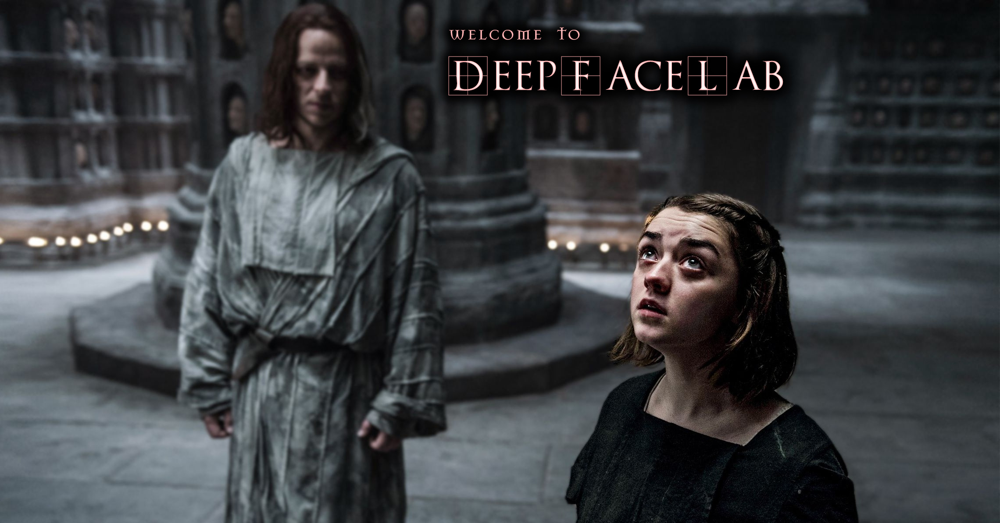

<table align="center"><tr><td align="center" width="9999">

  
## DeepFaceLab
  
the leading software for creating deep fakes

</td></tr>
<tr><td align="center" width="9999">

More than 95% of deepfake videos are created with DeepFaceLab.

DeepFaceLab is used by such popular youtube channels as

|[Ctrl Shift Face](https://www.youtube.com/channel/UCKpH0CKltc73e4wh0_pgL3g)|[Sham00k](https://www.youtube.com/channel/UCZXbWcv7fSZFTAZV4beckyw/videos)|[Collider videos](https://www.youtube.com/watch?v=A91P2qtPT54&list=PLayt6616lBclvOprvrC8qKGCO-mAhPRux)|[VFXChris Ume](https://www.youtube.com/channel/UCGf4OlX_aTt8DlrgiH3jN3g/videos)|
|---|---|---|---|

</td></tr>

<tr><td align="center" width="9999">

## Releases

||||
|---|---|---|
|Windows|[Google drive](https://drive.google.com/open?id=1BCFK_L7lPNwMbEQ_kFPqPpDdFEOd_Dci)|if the download quota is exceeded, add the file to your own google drive and download from it|
||[Torrent page](https://rutracker.org/forum/viewtopic.php?t=5558863)|Use bittorrent client.| 
|Google Colab|[github](https://github.com/chervonij/DFL-Colab)|by @chervonij . You can train fakes for free using Google Colab.|
|Linux|[github](https://github.com/lbfs/DeepFaceLab_Linux)|by @lbfs. May be outdated|
||||

</td></tr>

</table>

***
## [Guides and tutorials](https://mrdeepfakes.com/forums/forum-guides-and-tutorials)
***
## [Ready to work facesets](https://mrdeepfakes.com/forums/forum-celebrity-facesets)
***
## Communication groups:

[telegram (English / Russian)](https://t.me/DeepFaceLab_official)

[mrdeepfakes (English)](https://mrdeepfakes.com/forums/) - the biggest SFW and NSFW community

(Chinese) QQ group 951138799 for ML/AI experts

[deepfakes (Chinese)](https://deepfakescn.com)

[reddit r/GifFakes/ (English)](https://www.reddit.com/r/GifFakes/new/)

[reddit r/SFWdeepfakes/ (English)](https://www.reddit.com/r/SFWdeepfakes/new/)
***
## How I can help the project?

If you like this software, please consider a donation.

Current GOAL: next DeepFaceLab update.

[Donate via Yandex.Money](https://money.yandex.ru/to/41001142318065)

[Donate via Paypal](https://www.paypal.com/cgi-bin/webscr?cmd=_donations&business=lepersorium@gmail.com&lc=US&no_note=0&item_name=Support+DeepFaceLab&cn=&curency_code=USD&bn=PP-DonationsBF:btn_donateCC_LG.gif:NonHosted)
                    
bitcoin:31mPd6DxPCzbpCMZk4k1koWAbErSyqkAXr
***
You can collect faceset of any celebrities that can be used in DeepFaceLab and share it [in the community](https://mrdeepfakes.com/forums/forum-celebrity-facesets)
***

#deepfacelab #deepfakes #faceswap #face-swap #deep-learning #deeplearning #deep-neural-networks #deepface #deep-face-swap #fakeapp #fake-app #neural-networks #neural-nets
